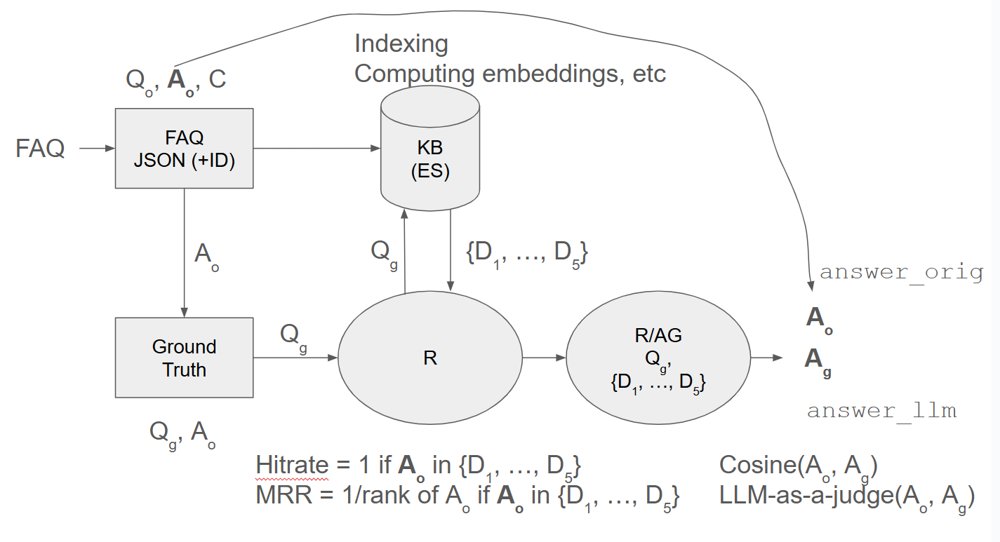

# Monitoring LLMs
## Summary of the RAG process

## Introduction

- Monitoring helps define the quality of a LLM doing:
  - Compute Different types of quality metrics:
      - LLM-as-a-judge to compute toxicity of LLM Answer
      - LLM-as-a-judge to assess quality of LLM Answer
      - Similarity score between expected and LLM answer
  - Store computed metrics in relational database
      - Store chat sessions and collect user feedback in database
  - Use Grafana to visualize metrics over time
      - Use Grafana to visualize user feedback and corresponding chat sessions
  - What else to monitor
      - System metrics: latency, traffic, errors, saturation.
      - Cost of used infrastructure, i.e. vector store and LLM API
- There are other metrics: the objective is to know, while the llm model is deployed if its performance is good and if its answers are aligned with what it is expected
- There LLM fitted to evaluate toxicity or quality of answers
- We want to store chat sessions and the feedback from users so there is trazability
- Latency, Traffic, Errors and Saturation are also system metrics that can be tracked

- Evaluation:
  - offline:
    - hitrate
    - mrr
    - cosine Similarity
    - llm as a judge
      
      - we have several answers -> then we use a llm to generate questions -> then we give this questions to generate new answers and the nwe compare the two answers
  - online:
    - A/B tests (split users between two ways or models and we evaluate kpi), experiments
    - user feedback
- monitoring: 
  - overall health of the system
  - user feedback: how good the answer is 

## Offline RAG evaluation

*the first part of the code is a wrap up to the previous modules*

## Monitoring User feedback

We want to capture the user feedback on the quality of the answers. Add thumbs up/down buttons or something similar. the course uses claude to create the code for the streamlit ui. 

We want to save users question and answers on postgres and their feedback.

It is importatn to have logs on the process

Use docker compose to set each step of the model inside. then we can interact with each container from the terminal using docker exec -it

we want to add something that can allow us to choose between vector search or text search. Also using different models, either connect with ollama or with vector search

### Using grafana

we add info about number of tokens, costs of using the llms, relevance of the answer etc then we also save conversations and answers and we want to be able to pull them from the database

for checking graphana we can generate synthetic data using a program that populates the tables constantly

